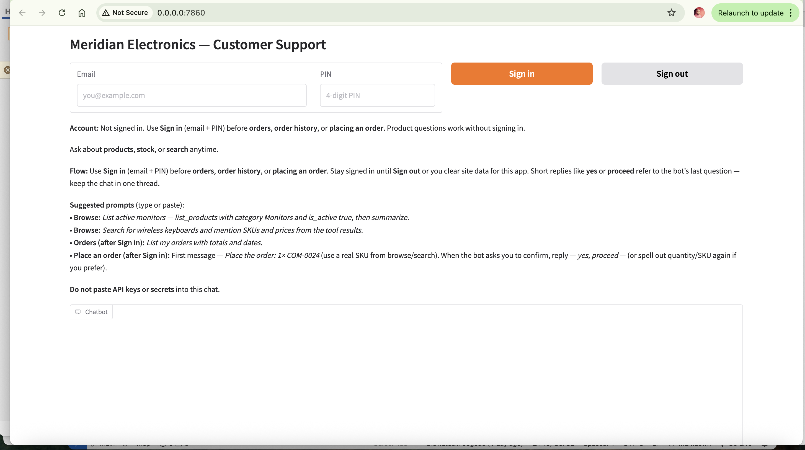
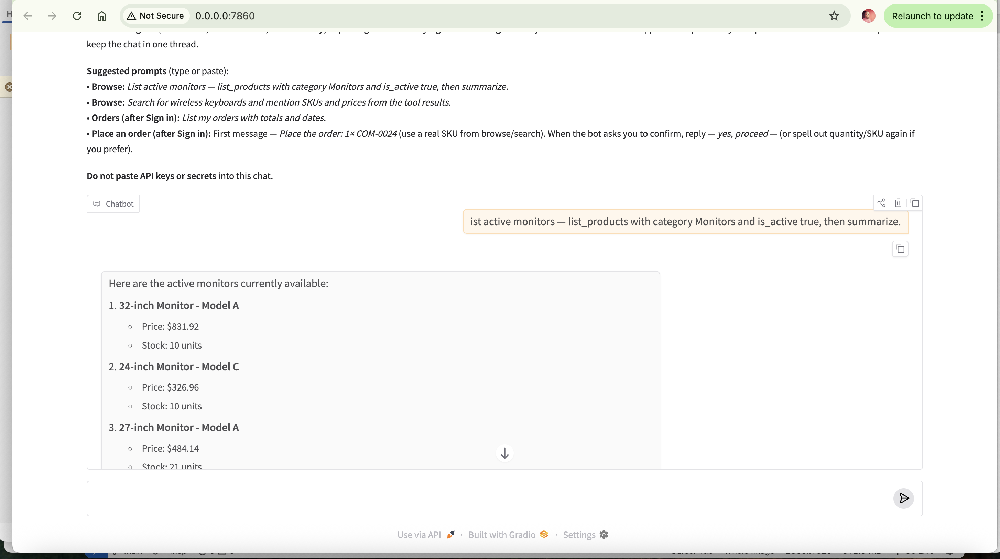
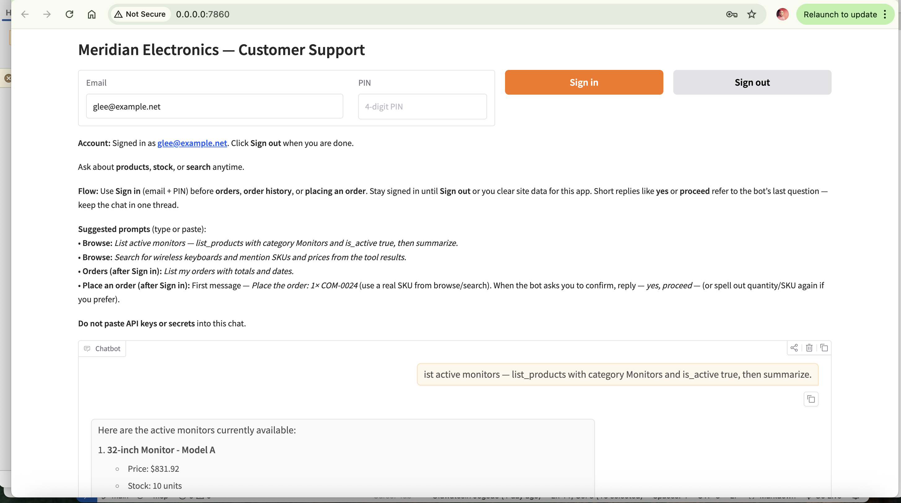
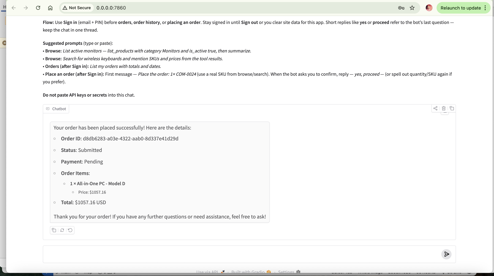
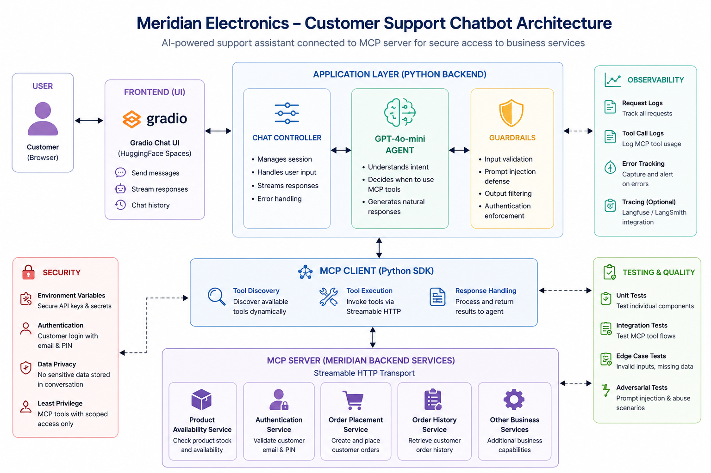

# Meridian MCP customer support

[](https://github.com/Oluwatosin-AiOps/mcp/actions/workflows/ci.yml)

Gradio UI + GPT-4o-mini tool-calling against Meridian’s MCP server (Streamable HTTP). Inventory and orders come from tools, not free‑text guesses.

**CI/CD:** GitHub Actions on **`main`** — automated **pytest** (offline suite) plus **Docker image build** on every push/PR, and an optional **manual EC2 deploy** workflow. See [CI/CD](#cicd) below.

## Screenshots

Gradio UI running locally; images live under **`sc/`**.

### Sign-in, account banner, and suggested prompts

Sign in with **email + PIN** before orders or order history; product questions work unsigned. Suggested prompts show example flows (browse, orders, placement).



### Product browse (MCP-backed catalog)

Listing active monitors: prices and stock come from MCP tools, not free‑text guesses.



### Signed-in session

After **Sign in**, the banner shows **Signed in as …**; the same chat thread supports follow-ups (including short confirmations like *yes, proceed*).



### Order placement

Place order → confirm → **`create_order`** via MCP; assistant returns order id, status, and total.



## Deployment (EC2)

**Deployment:** AWS EC2 with Docker Compose and Gradio on **7860**. Typical bootstrap:

1. **Ubuntu 22.04 or 24.04 LTS** instance; security group allows **inbound TCP 7860**.
2. Install Docker: `curl -fsSL https://get.docker.com | sudo sh` (on newer Ubuntu, `apt install docker-compose-plugin` alone often fails).
3. Clone the repo, `cp .env.example .env`, set `OPENAI_API_KEY` and `MCP_SERVER_URL`.
4. `docker compose up -d --build` — open **`http://<your-public-ip>:7860`** (Gradio is **not** on port 80; `http://ip/` alone will show connection refused).

Details: **`docs/aws_deployment.md`**, **`docker-compose.yml`**, **`scripts/ec2_diagnose.sh`** (run on the instance), **`scripts/ec2_bootstrap_ubuntu.sh`**.

## Architecture



| Layer | Code |
|-------|------|
| UI | `app/ui.py`, `app.py` |
| Agent | `app/agent.py` |
| Guardrails | `app/guardrails.py` |
| Auth | `app/auth_session.py` |
| MCP | `app/mcp_client.py` |
| Config | `app/config.py` |

The architecture diagram may show tracing stacks (e.g. Langfuse); the running code uses pytest, smoke scripts, and container logs.

## Decisions

- OpenAI SDK + official MCP Python SDK (no LangChain).
- Default model `gpt-4o-mini` (`MODEL_NAME`).
- uv dev (`pyproject.toml` / `uv.lock`); `requirements.txt` from `uv export` for pip and container builds.
- PIN gating and customer scope in code (`auth_session.py`), aligned with `docs/prompt_iterations.md`.
- Live MCP tests behind `MERIDIAN_*` env vars (`docs/test_results.md`).
- **CI/CD:** GitHub Actions — `ci.yml` (uv lockfile sync, `pytest -m "not integration"`, `docker build`) and optional `deploy-ec2.yml` (SSH `git pull` + `docker compose up` on the instance when secrets are configured).

## Setup

1. [uv](https://docs.astral.sh/uv/installation/), Python 3.12 (`.python-version`).
2. `uv sync`
3. Copy `.env.example` → `.env`; set `OPENAI_API_KEY`, `MCP_SERVER_URL`. Do not commit `.env`.
4. Without uv: `pip install -r requirements.txt` (Python ≥ 3.10).

## Run

```bash
uv run python app.py                      # Gradio
uv run python app.py --print-config       # Print MCP URL + model
uv run python app.py "Your question"      # One CLI turn
uv run pytest
uv run pytest -m "not integration" -q     # Skip integration markers
```

Smoke scripts (MCP only): `scripts/discover_tools.py`, `smoke_product_tools.py`, `smoke_order_history.py`, `smoke_order_placement.py` (placement creates orders—use only on the MCP endpoint you intend).

## CI/CD

Pipelines live under **`.github/workflows/`** and run on this repository’s **Actions** tab (status badge at the top of this README).

- **CI** — `ci.yml`: on every **push** and **pull request** to `main`, runs `uv sync --frozen`, `pytest -m "not integration"`, and a **`docker build`** so merges keep the locked dependencies, unit path, and production image valid.
- **CD (optional)** — `deploy-ec2.yml`: **manual** only (**Actions → Deploy EC2 → Run workflow**). Requires secrets **`EC2_HOST`**, **`EC2_USER`**, **`EC2_SSH_PRIVATE_KEY`**. Default deploy path **`/home/ubuntu/mcp`** must match the clone on the server; **`.env`** is never stored in GitHub. Restrict **TCP 22** to endpoints you trust (GitHub-hosted runners use changing egress unless you use a self-hosted runner or tunnel).

## Docs

| Path | Content |
|------|---------|
| `docs/problem_framing.md` | Scope and success criteria |
| `docs/mcp_tools.md` | Tool list |
| `docs/guardrails.md` | Input/output filters |
| `docs/test_results.md` | Pytest layout |
| `docs/prompt_iterations.md` | System prompt versions |
| `docs/aws_deployment.md` | EC2 + Docker Compose |
| `docs/project_structure.md` | Tree |
| `sc/` | README screenshots (UI flows) |
| `.github/workflows/ci.yml` | CI: pytest + Docker build |
| `.github/workflows/deploy-ec2.yml` | Optional manual EC2 redeploy |

## Requirements export

```bash
uv export --format requirements-txt --no-hashes --no-annotate > requirements.txt
```
